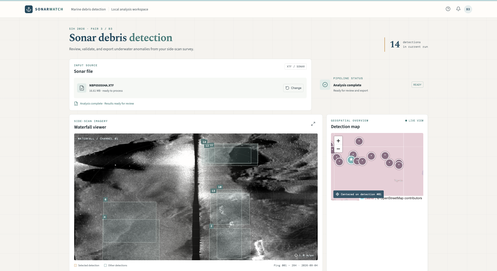
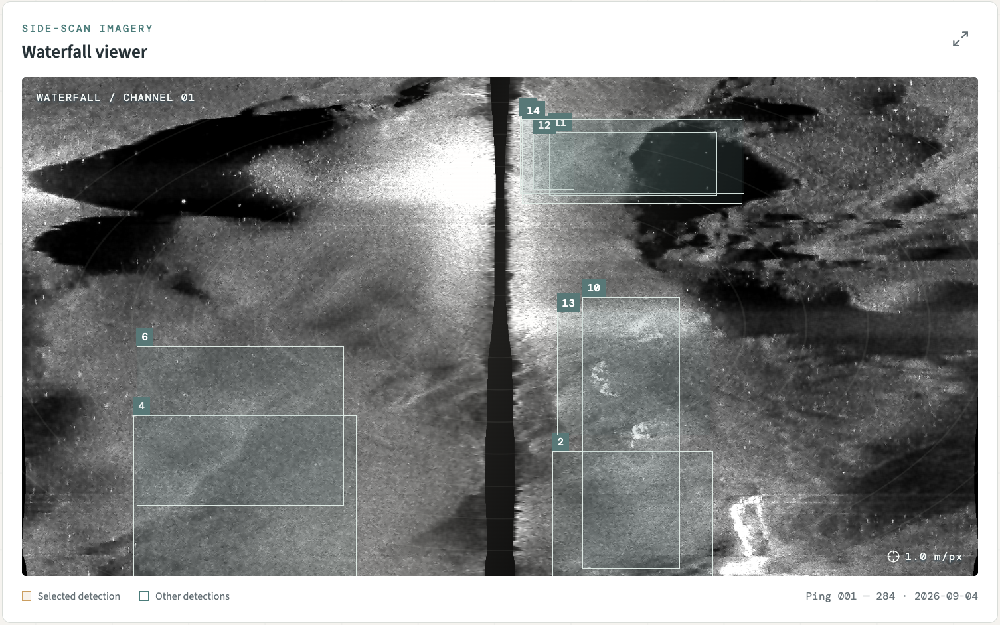
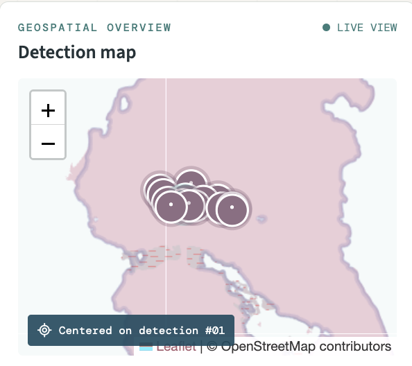
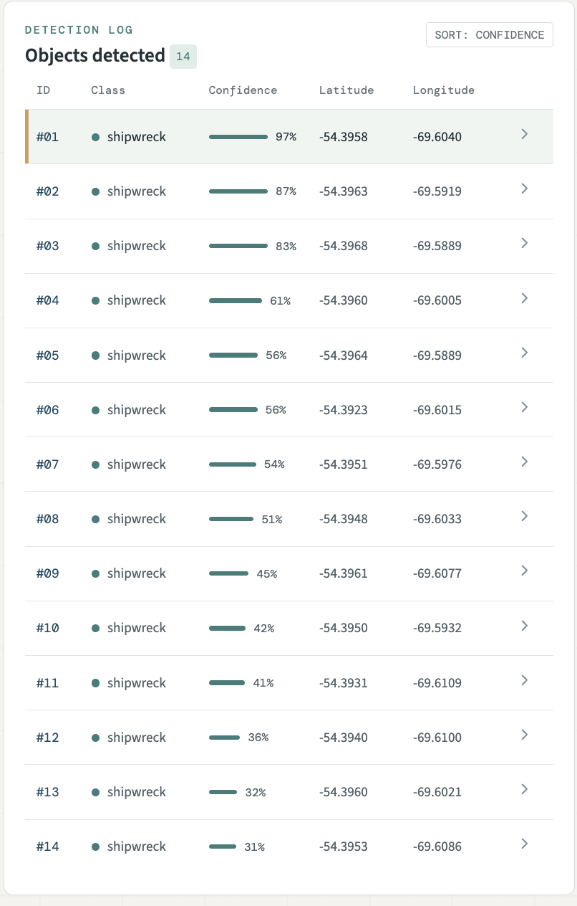
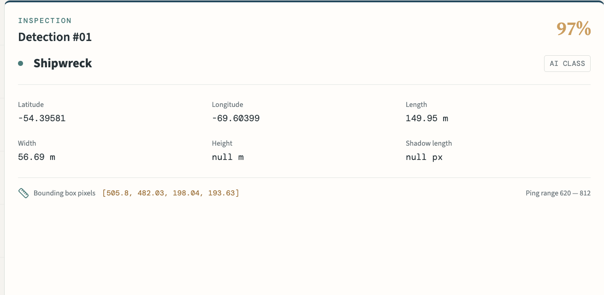
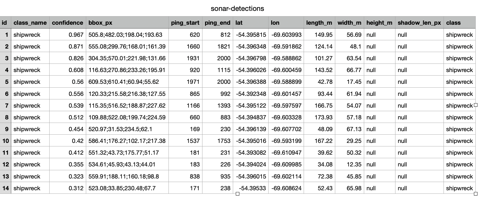
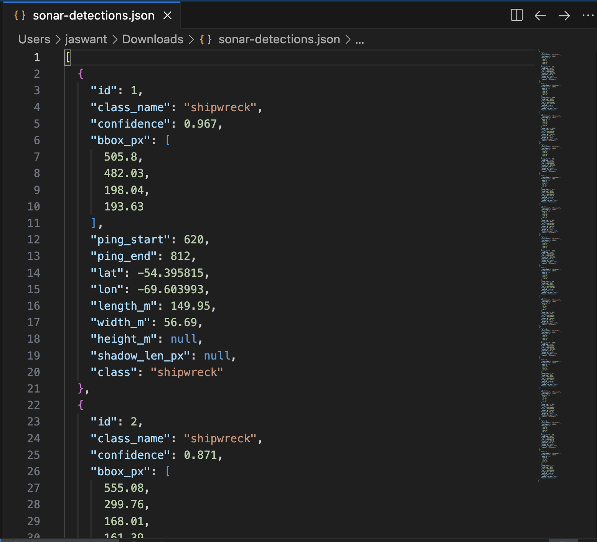
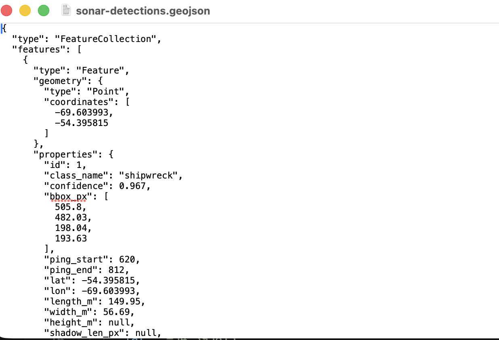

# SonarWatch — AI Side-Scan Sonar Debris Detection

Upload a raw sonar file; get back georeferenced seabed debris detections, each
traceable to the ping that saw it, its GPS coordinate, and its size in metres.

## 1. Project Information

- **Project Title:** SonarWatch – AI-Powered Underwater Debris and Anomaly Detection from Side-Scan Sonar
- **PS ID:** SIH26057
- **PS Title:** AI-Powered Automated Underwater Marine Debris and Anomaly Detection System using Side-Scan Sonar Imagery
- **Category:** Software
- **Theme:** Disaster Management
- **Team Name:** Fork it

## 2. Problem Statement

Cyclones, tsunamis, floods and vessel accidents leave debris fields on the
seabed: sunken and capsized vessels, containers and cargo lost overboard,
structural wreckage swept out from the coast, and ghost nets. That debris
obstructs shipping channels and port approaches, fouls fishing grounds, damages
submarine cables and pipelines, and marks the search area after a maritime
incident. Locating it quickly is a precondition for safe navigation, for salvage
and clearance operations, and for search and recovery.

Side-scan sonar is the instrument used to survey these areas, and a single tow
produces kilometres of continuous greyscale imagery. Today a trained analyst
finds targets in it by eye — slow, expensive, inconsistent between operators, and
a poor fit for a post-disaster response where the survey area is large and the
answer is needed in hours rather than weeks.

Pointing an object detector at the raw file does not work either, for three
reasons:

1. **The raw image is geometrically wrong.** Samples are timed along the slanted
   path from sonar to seabed, so everything is compressed near the track line.
   There is a blind wedge beneath the tow, brightness falls off steeply with
   range, and multiplicative speckle covers all of it.
2. **The image is the wrong shape.** A survey line is one image thousands of
   pixels tall. Detectors need small square tiles — but cut naively, objects on
   tile boundaries are destroyed and the link back to the survey is lost.
3. **A pixel box is not an answer.** "Something at pixel (412, 980)" is useless
   to a survey team. They need a latitude, a longitude and a size in metres.

## 3. Proposed Solution

SonarWatch is an end-to-end pipeline with a web dashboard that automates this
survey-review step, flagging debris and seabed anomalies without an analyst
scrolling the imagery. A user uploads a raw XTF sonar file. The backend cleans and geometrically corrects the imagery, cuts
it into detector-ready tiles, runs a YOLO segmentation model over each tile, and
converts every hit into a real-world record with WGS84 coordinates and physical
dimensions. Results appear in a table and on a map, and export as JSON, CSV or
GeoJSON.

The design rests on one invariant: **image row `i` is always ping table row
`i`**. Cropping, resampling and tiling all carry the ping metadata table along
with the pixels, so any detection pixel inverts back to the exact ping that
produced it — and with it the time, position, heading and altitude of the sonar
at that instant.

## 4. Key Features

- Raw XTF sonar file upload with asynchronous job processing
- Automatic sonar channel selection and fault detection (rejects saturated or
  reverse-stored channels without user intervention)
- Full geometric correction: bottom tracking, nadir removal, slant-range to
  ground-range projection, gain normalisation, speckle suppression
- Overlapping tiling with sidecar metadata so no detection loses its provenance
- YOLO11n-seg inference with cross-tile de-duplication by geographic overlap
- Georeferenced output: every detection carries lat/lon, ping span, and size in
  metres
- Interactive dashboard with waterfall viewer, detection table and map
- Report export in JSON, CSV and GeoJSON

## 5. Technology Stack

- **Frontend:** React 18, Vite 6, Leaflet (map), lucide-react (icons)
- **Backend:** Python, FastAPI, uvicorn
- **Machine Learning:** Ultralytics YOLO11n-seg, PyTorch (trained on Google Colab T4)
- **Signal Processing:** pyxtf, NumPy, OpenCV, pandas, SciPy
- **Geospatial:** pyproj (WGS84 geodesics and towfish layback correction)
- **Data Format:** XTF (eXtended Triton Format) side-scan sonar files

## 6. Architecture

See [docs/architecture.md](docs/architecture.md) for the detailed component and
data flow description.

```text
User
  |
  v
React Dashboard  (upload, status, waterfall, table, map)
  |
  v
FastAPI Backend  (async job runner)
  |
  v
Preprocessing    Stage 1  read XTF -> ping metadata table + raw waterfall
                 Stage 2  clean    -> nadir removal, ground range, gain, despeckle
                 Stage 3  tile     -> 640x640 tiles + JSON sidecars
  |
  v
YOLO11n-seg      per-tile inference -> boxes + confidences
  |
  v
Georeferencing   invert tiling -> ping -> WGS84 position + size in metres
  |
  v
Detection Report  JSON / CSV / GeoJSON
```

## 7. Repository Structure

```text
SSS-pipeline/
├── README.md
├── LICENSE
├── requirements.txt          # Python dependencies
│
├── src/
│   ├── backend/              # FastAPI service - self-contained
│   │   ├── main.py           #   API: /upload /status /waterfall /results
│   │   ├── core/
│   │   │   ├── preprocess.py #   XTF -> cleaned, tiled imagery
│   │   │   ├── reports.py    #   detections -> report schema
│   │   │   └── geotag.py     #   WGS84 geodesics, layback
│   │   ├── models/           #   YOLO weights - NOT in git, see 11.2
│   │   ├── uploads/          #   runtime: uploaded files (gitignored)
│   │   └── outputs/          #   runtime: per-job results (gitignored)
│   │
│   └── frontend/             # React + Vite dashboard
│       ├── index.html        #   Vite entry point (must sit at this level)
│       ├── package.json
│       ├── vite.config.js
│       └── src/              #   React components
│           ├── App.jsx
│           ├── api/backend.js
│           └── components/
│
├── docs/architecture.md
├── submission/
│   ├── PRESENTATION.md
│   └── DEMO.md
└── assets/screenshots/
```

Two notes on this layout:

- `src/frontend/index.html` sits above `src/frontend/src/` because Vite resolves
  `index.html` as the entry point from its project root, then follows the
  `<script src="/src/main.jsx">` inside it.
- The backend is run from inside `src/backend/`, so `models/`, `uploads/` and
  `outputs/` all resolve within that folder and the service stays
  self-contained.

## 8. Final Presentation

See [submission/PRESENTATION.md](submission/PRESENTATION.md).

## 9. Demo Video

See [submission/DEMO.md](submission/DEMO.md).

## 10. Screenshots

Captured from a live run on `NBP050504A.XTF`.

**Dashboard**



**Waterfall viewer with detections overlaid**



**Geotagging — detections plotted at their WGS84 positions**



**Object detection results**



**Per-object inspection panel**



**Report export — CSV, JSON and GeoJSON**







## 11. Installation

### 11.1 Clone and install dependencies

```bash
git clone https://github.com/shretimanegi/ForkIt
cd ForkIt

# Backend
python3 -m venv .venv
source .venv/bin/activate          # Windows: .venv\Scripts\activate
pip install -r requirements.txt

# Frontend
cd src/frontend
npm install
cd ../..
```

### 11.2 Files you must download separately

Three things are **not** in this repository and have to be obtained before the
project will run or be retrained. They are excluded because of file size, or
because they are third-party data with their own licence.

| What | Size | Required for | Where to put it |
|---|---|---|---|
| **[Trained model weights `best.pt`](https://drive.google.com/file/d/1v1tmOJGpCuScoK6_7rUuwlC1tbNRlBRH/view?usp=sharing)** | ~5.7 MB | **Detection. Without it the pipeline runs but returns zero detections.** | `src/backend/models/best.pt`|
| **Test sonar data** `NBP050504A.XTF` | ~17 MB | Trying the system without your own survey file | anywhere; you select it in the UI |
| **Training dataset** (YOLO format) | — | Retraining only. Not needed to run the app. | Google Drive |

**Model weights.** Trained on Google Colab (see Technology Stack) and stored in
the team's Google Drive at `SIH_2026/models/improved_dataset-2/weights/best.pt`.
Create the folder and place the file:

```bash
mkdir -p src/backend/models
# copy the downloaded best.pt into src/backend/models/best.pt
```

The backend checks for this file on every job, so it can be added without
restarting the server. If it is missing, jobs still complete successfully but
`/results` returns an empty list — a missing model looks identical to "nothing
was found", so check this first if no detections appear.

**Test sonar data.** The validation file is public, published by the Marine
Geoscience Data System under CC BY-NC-SA 3.0. See the Data Attribution section
below for the citation. Any XTF side-scan file will work.

**Python and Node packages** are installed by the commands in 11.1 — `pip` pulls
PyTorch in as a dependency of `ultralytics`, which is the largest download
(several hundred MB) and the slowest step of the install.

## 12. Run

Two processes, in separate terminals:

```bash
# Terminal 1 — backend API on http://localhost:8000
cd src/backend
uvicorn main:app --reload --port 8000

# Terminal 2 — frontend on http://localhost:5173
cd src/frontend
npm run dev
```

The backend must be started from inside `src/backend/` — it resolves `models/`,
`uploads/` and `outputs/` relative to the working directory, which keeps all
runtime data inside that folder.

Open <http://localhost:5173> and upload an XTF file.

The frontend calls the backend at `http://localhost:8000` by default. To point
it elsewhere, set `VITE_API_BASE_URL`.

### API endpoints

| Method | Endpoint | Purpose |
|---|---|---|
| `POST` | `/upload` | Submit an XTF file, returns a `job_id` |
| `GET` | `/status/{job_id}` | `queued` → `processing` → `completed` / `failed` |
| `GET` | `/waterfall/{job_id}` | Processed waterfall image (PNG) |
| `GET` | `/results/{job_id}` | Detection records |

## 13. Detection Report Schema

A twelve-field contract fixed at the start of the project and shared across all
sub-teams, so preprocessing, model and frontend could be built in parallel.

| Field | Type | Meaning |
|---|---|---|
| `id` | str | Unique detection identifier |
| `class` | str | `shipwreck`, `ghost_net`, `pipe`, `cylinder`, `debris` |
| `confidence` | float | Model score, 0–1 |
| `bbox_px` | [x,y,w,h] | Bounding box in tile pixels |
| `ping_start` | int | First ping row containing the object |
| `ping_end` | int | Last ping row |
| `lat` | float | Seabed latitude (WGS84) — not the sonar's own fix |
| `lon` | float | Seabed longitude (WGS84) |
| `length_m` | float | Along-track extent |
| `width_m` | float | Across-track extent |
| `height_m` | float | Height estimated from shadow geometry |
| `shadow_len_px` | float | Measured shadow length in pixels |

## 14. Results

Validated on **NBP050504A.XTF** — 2,001 pings from a towed side-scan survey of
the Chilean Inland Passage (NBP0505 expedition, Marine Geoscience Data System).

- 2,001 pings parsed, cleaned and tiled into 16 tiles at 0.2863 m/pixel
- 14 detections returned at confidence 0.51 – 0.97, each georeferenced
- Tiling verified pixel-exact against the source waterfall
- Bottom-tracked altitude agrees with the recorded value to 1.46 m median, on a
  file where the recorded altitude field is frequently zero or invalid

## 15. Future Scope

- **Use the segmentation masks.** The model already outputs per-pixel masks;
  only bounding boxes are currently read. Masks would give true object outlines
  and a far better shadow measurement.
- **Populate `height_m` and `shadow_len_px`** by measuring the acoustic shadow
  cast behind each detection.
- **Retrain on pipeline-generated tiles** so the pixel-to-metre scale of the
  training set matches the imagery the model sees at inference.
- **Extend beyond one class** to the full five-class schema (ghost nets, pipes,
  cylinders, generic debris).
- **Persist job state** in a database rather than in memory, so results survive
  a server restart.
- **Multi-line survey mosaicking** to stitch adjacent survey lines into a single
  georeferenced map.

## 16. Team — Fork it

| Name | Role |
|---|---|
| Shretima Negi | `Reading raw file` |
| Yashvi Garg | `Backend` |
| Ananya Gupta | `Frontend` |
| Manasvi Sharma | `Geotagging` |
| Tanisha Gautam | `Yolo training` |
| Sonal Verma | `Dataset preparation` |

## Data Attribution

The test dataset is published by the Marine Geoscience Data System under
CC BY-NC-SA 3.0:

> Anderson, J. and B. Hallet (2015). *Raw towed Sidescan Sonar Data (XTF format)
> acquired along the Chilean Inland Passage Fjord during the Nathaniel B. Palmer
> expedition NBP0505 (2005).* MGDS. doi:10.1594/IEDA/306159

## Important

Do not commit passwords, API keys, access tokens, `.env` files or other
credentials to this repository. Model weights (`models/*.pt`) and generated
outputs are excluded via `.gitignore`.
